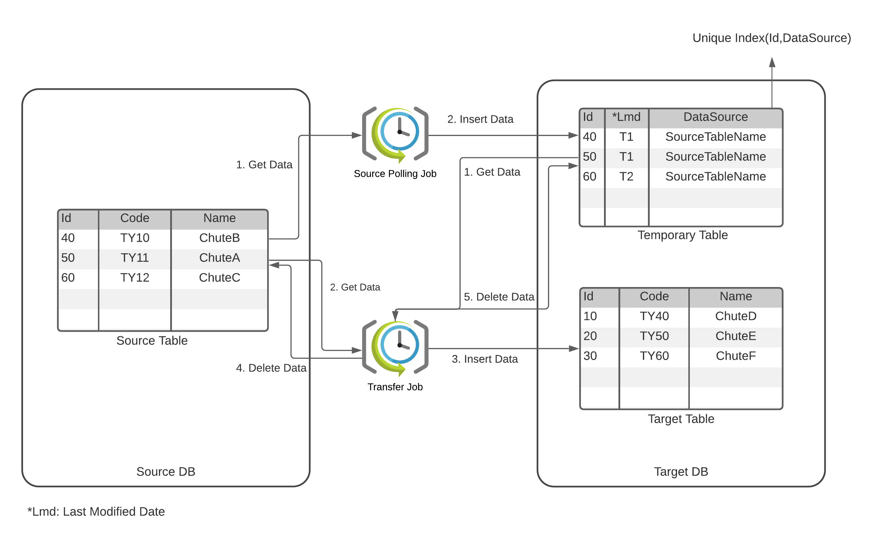

<!-- ABOUT THE PROJECT -->
## About The Project
Transporter is an open-source database table transporter tool developed by Trendyol with love .

### Features
- Moves table data from source database to target database
- Performs transporting on given time intervals
- Works two-way with MSSQL and Couchbase; MSSQL <b><-></b> MSSQL, MSSQL <b><-></b> Couchbase, Couchbase <b><-></b> Couchbase

#### Why?
The reason we developed this tool is because we needed to archive our high throughput tables.. In other words: We need to move our table data from one database to another database. Some of our tables have a daily throughput of more than 1 million. We use these tables for reports and other things. To achieve high performance, we need to archive the data we do not need all the time. Some data is stale after a month, some after 6 months. There are a lot of tools out there that do just that, but they are not very flexible or extensible. So we developed our own tool, which has proven to be very useful, and we decided to share it with the community.

#### The How?
Transporter has two important concepts; Source and Target. As inferred by names our goal is to move data from Source to Target. If there is no Target specified the transporter will perform only delete operation on Source. Each transporting operation corresponds to a json object. Using Quartz from each json object a cron job is produced.

There are two jobs that run in parallel. Polling Job gets Id's of data from source and inserts it to a temporary table that we call Interim. Transfer Job gets Id from interim table and gets data from source according to Id.
In database processes, data safety is our first concern. In any of transferring steps, if Transporter fails, data would still be protected.

<!-- GETTING STARTED -->
## Getting Started
To use Transporter, there are config examples in "examples/configs" folder. Transporter is a dockerized project, so you can deploy to a Kubernetes cluster if you want. There are two string config keys that should be given to Transporter, "PollingJobSettings" and "TransferJobSettings" as strings. You can use online sites like [Json Online Converter](https://tools.knowledgewalls.com/jsontostring) to convert your JSON file to string.

## Roadmap
See the [open issues]([https://github.com/github_username/repo_name/issues](https://github.com/github_username/repo_name/issues)) for a list of proposed features (and known issues).

 <!-- CONTRIBUTING -->
## Contributing
Contributions are what make the open source community such an amazing place to be learn, inspire, and create. Any contributions you make are greatly appreciated.

1. Fork the Project
2. Create your Feature Branch (`git checkout -b feature/AmazingFeature`)
3. Commit your Changes (`git commit -m 'Add some AmazingFeature'`)
4. Push to the Branch (`git push origin feature/AmazingFeature`)
5. Open a Pull Request

 <!-- LICENSE -->
## License
Distributed under the MIT License. See [`LICENSE`](https://choosealicense.com/licenses/mit/) for more information.

 <!-- CONTACT -->
## Contact
Fatiha Beqirovski - [Github](https://github.com/FatihaBeqirovski) - [fatihabeqirovski@hotmail.com](mailto:fatihabeqirovski@hotmail.com)
Mehmet Fırat Kömürcü - [Github](https://github.com/MehmetFiratKomurcu) - [mehmetfiratkomurcu@hotmail.com](mailto:mehmetfiratkomurcu@hotmail.com)